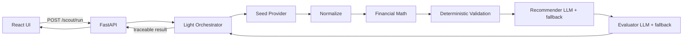

# Timex Scout MVP Implementation Plan

## Goal and guardrails
Implement the seven-step flow from [BUILD_PLAN.md](BUILD_PLAN.md): load profile, load listings, normalize, deterministically validate, LLM-recommend top 3, LLM-evaluate, display. Keep it small and modular. Deterministic code owns fetching/loading, normalization, validation, and money. LLM owns only recommendation reasoning and the evaluator check, each with a deterministic fallback so the demo runs with no API key.

## Key decisions (confirmed)
- No database. Listings, profile, and reference purchases load into memory at startup from JSON.
- LLM steps use OpenAI when `OPENAI_API_KEY` is set; otherwise a deterministic fallback produces equivalent-shaped output.
- Recompute `total_price_cad` / `within_budget` / eligibility deterministically. The precomputed seed fields are used only as a sanity check, not trusted as truth.
- Create `collector_profile.json` (missing from repo) from the assignment prompt: brand Timex, total <= $50 CAD incl. shipping to M6K1V8, not explicitly broken (battery replacement OK), interesting/vintage/deadstock/collab appeal.

## Architecture (matches Build Plan decision table)

## Backend pipeline detail
- Provider abstraction ([backend/app/providers/](backend/app/providers/)): `base.py` defines a `ListingProvider` interface with `fetch_raw()`; `seed_provider.py` reads `seed_listings.normalized.json`. eBay/Etsy left as thin documented stubs to show the seam (not implemented).
- Normalize ([pipeline/normalize.py](backend/app/pipeline/normalize.py)): map provider records to the shared schema in [normalized_listing_schema.json](normalized_listing_schema.json) and parse into Pydantic models. Seed is already normalized, so this is mostly validation/coercion, but it lives behind the same function a live provider would use.
- Financial math ([pipeline/finance.py](backend/app/pipeline/finance.py)): integer-cents only. `total_cad_cents = round((price + shipping) * fx_rate_to_cad)`, compare to 5000 cents. Returns a transparent breakdown (item, shipping, fx, total) for the UI. Never sent to the LLM as a decision.
- Validation ([pipeline/validate.py](backend/app/pipeline/validate.py)): deterministic hard gates, each returning a pass/fail + reason for traceability:
  - brand is Timex (excludes the Westclox seed)
  - `is_watch` true (excludes parts lot, strap-only, jewelry, box-only)
  - not explicitly broken: exclude `for parts`/`not working or broken`/`parts only`; allow dead/old battery and `untested` but record them as risk flags
  - within budget (from finance step)
  - required fields present; marketplace is known (eBay/Etsy/Chrono24/seed)
  Output: eligible listings + an audit list of excluded ones with reasons.
- Recommender ([pipeline/recommend.py](backend/app/pipeline/recommend.py)): receives only eligible listings plus computed totals. Builds a prompt from `collector_profile.json` and the three `reference_purchases.normalized.json` as few-shot taste examples; asks for top 3 with `why_it_matches` and `risk_notes`. Deterministic fallback ranks by a simple transparent score (taste-tag overlap with references, condition quality, seller rating, budget headroom). Same output shape either way.
- Evaluator ([pipeline/evaluate.py](backend/app/pipeline/evaluate.py)): light check over the top 3 answering the Build Plan questions (faithful to listing, respects budget/condition, no ignored risk). Returns a short note/score per recommendation. Deterministic fallback flags any rec whose claims aren't grounded in its listing fields or that has unaddressed risk flags.
- Orchestrator ([orchestrator.py](backend/app/orchestrator.py)): a light coordinator that calls each step in order and returns one traceable result object (profile used, counts at each stage, exclusions with reasons, recommendations, evaluator notes). Holds no domain intelligence.
- API ([main.py](backend/app/main.py)): `POST /scout/run` runs the pipeline and returns the result; mounts `/static` for placeholder watch SVGs referenced by `image_url`.

## Frontend (thin)
Single screen in [frontend/src/App.tsx](frontend/src/App.tsx): a "Run watch search" button calling `/scout/run`, then top-3 recommendation cards. Small components: `RecommendationCard`, `BudgetBreakdown` (item + shipping + fx = total vs $50), `RiskFlags`, `EvaluatorNote`. Shared `types.ts` mirrors the backend result.

## Proposed file structure
- `backend/app/main.py` - FastAPI app, route, static mount
- `backend/app/orchestrator.py` - light agent coordinating the pipeline
- `backend/app/config.py` - paths, budget constant, OpenAI key detection
- `backend/app/models.py` - Pydantic models (Listing, Recommendation, ScoutResult)
- `backend/app/providers/base.py`, `seed_provider.py` (+ `ebay_provider.py`/`etsy_provider.py` stubs)
- `backend/app/pipeline/normalize.py`, `finance.py`, `validate.py`, `recommend.py`, `evaluate.py`
- `backend/app/llm/client.py` - thin OpenAI wrapper with key detection + JSON helper
- `backend/app/data/collector_profile.json` (new) + copies of the two normalized JSON datasets
- `backend/app/static/images/watch-placeholder-1..8.svg` - simple placeholders
- `backend/requirements.txt`, `backend/README.md`
- `frontend/` - Vite React+TS app (`src/App.tsx`, `src/api.ts`, `src/types.ts`, `src/components/*`)

## Implementation order
1. Backend scaffold: `config.py`, `models.py`, data folder + `collector_profile.json`, copy datasets, placeholder SVGs.
2. Provider abstraction + seed provider.
3. Deterministic core: `normalize.py`, `finance.py` (integer cents), `validate.py` with audit reasons.
4. `llm/client.py` with key detection.
5. `recommend.py` and `evaluate.py`, each LLM + deterministic fallback, identical output shapes.
6. `orchestrator.py` to wire steps into one traceable result.
7. `main.py` `POST /scout/run` + static mount; verify end-to-end with no API key (fallback path).
8. Frontend: API call, types, recommendation cards with budget breakdown, risk flags, evaluator notes.
9. READMEs / run instructions; quick manual pass of the full flow.

## Notes / non-goals
- No PostgreSQL, no auth, no scraping, no live API calls in MVP (provider seam documented only).
- Evaluator stays a lightweight quality gate, not a metrics framework.
- Recommender never decides hard eligibility; budget/broken exclusions happen before it.