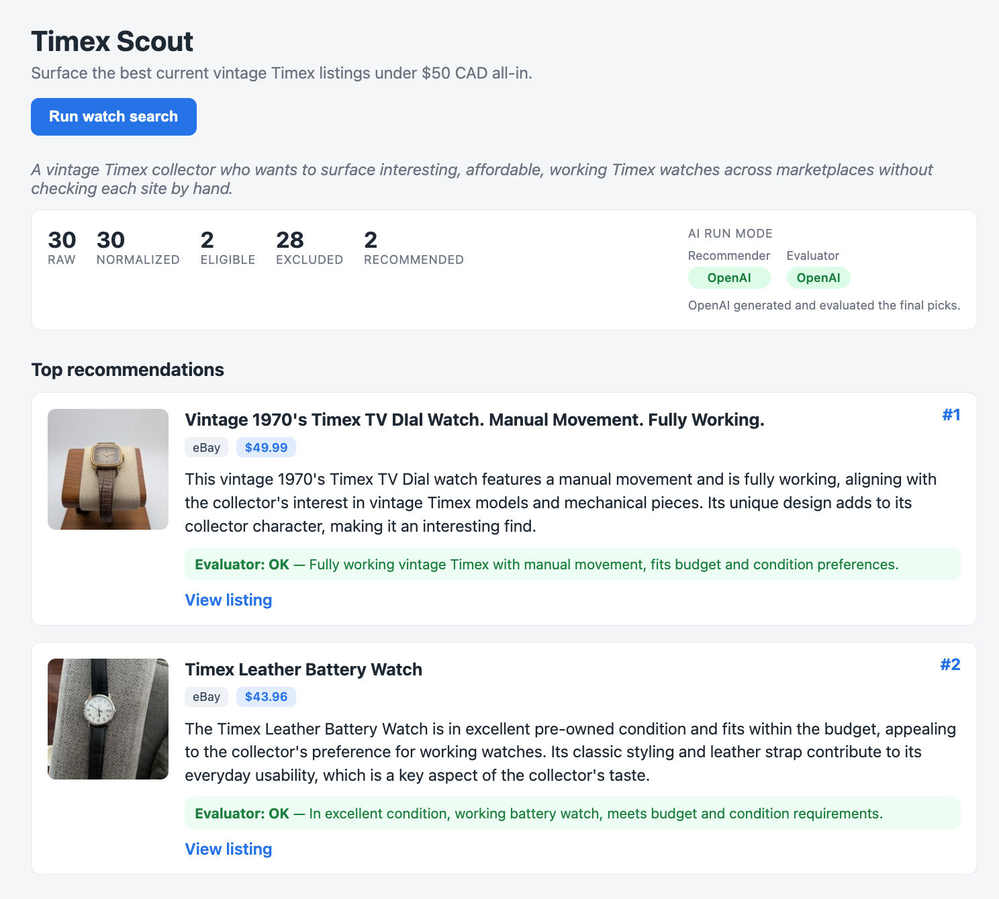

# Timex Scout MVP

A personal vintage Timex scout for one known collector. It surfaces the best
current marketplace listings that fit the collector's known taste and hard
constraints, so they don't have to check eBay, Etsy, and Chrono24 by hand.

The product loads a stored collector profile, loads marketplace listings,
normalizes them into one schema, deterministically validates hard constraints
(budget, condition, brand), recommends the top three candidates with reasoning,
runs a lightweight evaluator quality gate, and shows the results in a thin web UI.

## Latest V2 demo work

After the initial MVP submission, I continued improving the app on follow-up branches. The latest V2 work adds OpenAI-backed recommender and evaluator paths, plus an eBay listing provider for collecting live active listings.

The original deterministic pipeline remains intact, and the live integrations are designed as optional provider/LLM layers rather than hard dependencies. Seed-data fallback remains available so the demo does not depend on live APIs being available.



See the `v2-live-integrations` and `v2-ebay-provider` branches for the latest integration work.

## What the app does

1. Loads the collector profile and three reference purchases (taste examples).
2. Fetches listings from a provider (seed data by default).
3. Normalizes listings into a shared schema.
4. Deterministically validates hard constraints and records why anything was excluded.
5. Recommends the top three eligible candidates with reasoning.
6. Runs an evaluator check over those recommendations.
7. Returns one traceable result and renders it in the UI.

Design principle: deterministic code owns anything where correctness matters
(loading, normalization, validation, and all money math). The LLM is used only
where judgment helps (recommendation reasoning and the evaluator check), and both
LLM steps have deterministic fallbacks so the demo always works.

## Architecture overview

```
React UI  ->  FastAPI  ->  Orchestrator (light agent)
                               |
        +----------------------+----------------------+
        |                      |                      |
   Provider              Deterministic            Judgment (LLM + fallback)
   (seed / stubs)        normalize -> finance      recommend -> evaluate
                         -> validate
```


| Component           | Agent?          | Why                                     |
| ------------------- | --------------- | --------------------------------------- |
| Orchestrator        | Light agent     | Coordinates the pipeline, returns trace |
| Marketplace fetcher | No (tool)       | Deterministic retrieval + normalization |
| Filter / validator  | No              | Hard constraints must be deterministic  |
| Recommender         | Yes (LLM)       | Needs judgment, ranking, explanation    |
| Evaluator           | Light LLM check | Quality gate over recommendations       |


Key backend modules (`backend/app/`):

- `providers/` - provider abstraction: `base.py` interface, `seed_provider.py` (default), `live_stubs.py` (eBay/Etsy placeholders).
- `pipeline/normalize.py` - raw records -> `Listing` models.
- `pipeline/finance.py` - landed-cost math in integer cents (item + shipping, converted to CAD).
- `pipeline/validate.py` - hard constraints with per-listing rejection reasons.
- `pipeline/recommend.py` - LLM recommender with deterministic fallback.
- `pipeline/evaluate.py` - LLM evaluator quality gate with deterministic fallback.
- `orchestrator.py` - wires the steps into one traceable `ScoutResult`.
- `main.py` - FastAPI app (`/health`, `/scout/run`, `/static`).

## How to run the backend

Requires Python 3.10+.

```bash
cd backend
python3 -m venv .venv
source .venv/bin/activate
pip install -r requirements.txt
uvicorn app.main:app --reload --port 8000
```

Endpoints:

- `GET /health` -> `{"status": "ok"}`
- `POST /scout/run` -> the full `ScoutResult` JSON
- `GET /static/images/...` -> placeholder watch images

Quick API check:

```bash
curl -s http://127.0.0.1:8000/health
curl -s -X POST http://127.0.0.1:8000/scout/run | python3 -m json.tool
```

## How to run the frontend

Requires Node.js 18+.

```bash
cd frontend
npm install
npm run dev
```

Open the printed URL (default [http://localhost:5173](http://localhost:5173)) and click **Run watch search**.
The UI shows a summary bar (pipeline counts and recommender/evaluator modes) and
the top three recommendation cards. The frontend calls the backend at
`http://127.0.0.1:8000`, so start the backend first.

## Verifying the no-API-key deterministic fallback path

The app is designed to run end to end with no OpenAI key. With no key set, both the
recommender and evaluator use deterministic logic.

Backend-only check (no server needed):

```bash
cd backend && source .venv/bin/activate && unset OPENAI_API_KEY \
  && python3 -c "from app.orchestrator import run_scout; r = run_scout(); print(r.model_dump_json(indent=2))"
```

Expected high-level result with the bundled seed data:

- `counts`: `{"raw": 60, "normalized": 60, "eligible": 35, "excluded": 25, "recommended": 3}`
- `recommender_mode`: `"fallback"`, `evaluator_mode`: `"fallback"`, `llm_used`: `false`
- 3 recommendations and 3 evaluator notes

In the UI, the same fallback state shows as `recommender: fallback`,
`evaluator: fallback`, `llm_used: false` in the summary bar.

## Environment variables

All are optional. The demo runs without any of them.


| Variable         | Required | Default       | Purpose                                                                                          |
| ---------------- | -------- | ------------- | ------------------------------------------------------------------------------------------------ |
| `OPENAI_API_KEY` | No       | (unset)       | When set, the recommender/evaluator use OpenAI. When unset, both use the deterministic fallback. |
| `OPENAI_MODEL`   | No       | `gpt-4o-mini` | Overrides the OpenAI model used when a key is set.                                               |


Example:

```bash
export OPENAI_API_KEY=sk-...     # optional; enables the LLM path
```

## Marketplace providers (MVP scope)

In this MVP, eBay, Etsy, and Chrono24 are represented by **provider stubs**
(`backend/app/providers/live_stubs.py`), and the demo runs on bundled, realistic
**seed data** (`backend/app/data/seed_listings.normalized.json`). Seed data is a
deliberate design choice, not a shortcut: API approvals can be slow and scraping
is brittle, so seeded-but-realistically-shaped listings let the full product
experience run reliably (load -> validate -> rank -> explain).

### Provider abstraction

All providers implement one small interface (`ListingProvider.fetch_raw`) in
`backend/app/providers/base.py`. The rest of the pipeline only ever sees the
normalized schema, so a live marketplace provider can be added later **without
changing validation, financial math, recommendation, evaluator, or UI logic**.
Swapping the source is the only change required:

```python
# Today (default, reliable):
result = run_scout(provider=SeedProvider())

# Later (no other changes needed):
result = run_scout(provider=EbayProvider())
```

## Future work: live eBay integration

The eBay API key is approved, so the natural next step is implementing
`EbayProvider.fetch_raw` to call the eBay Browse API and return raw items, then
mapping those fields in `normalize.py`. Because of the provider abstraction:

- Validation, finance, recommender, evaluator, and UI stay unchanged.
- The fetcher applies only broad provider-side constraints (keyword, category,
rough price); all hard rules remain in deterministic validation.
- Etsy can follow the same pattern once its API key is approved.

Out of scope for this MVP: live API calls, scraping, authentication, a database,
and broad marketplace coverage. The focus is a correct, traceable, presentable
end-to-end flow.